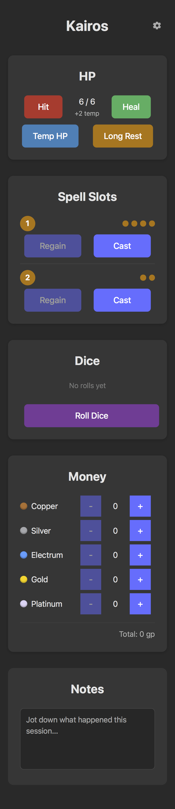

# DnD Companion

A lightweight D&D character tracker for managing health, spell slots, currency, dice rolls, and notes — all in the browser.

## Screenshot



## Features

- **Health tracking** — track current HP, apply damage/healing, long rest
- **Spell slots** — track slots per level, cast and regain slots
- **Dice roller** — roll d4/d6/d8/d10/d12/d20/d100 with roll history
- **Currency** — track CP, SP, EP, GP, PP
- **Notes** — free-form session notes
- **First-run wizard** — configure character name, max HP, and spell slot levels on first launch

## Getting started

```bash
npm install
npm run dev
```

Open [http://localhost:5173](http://localhost:5173) in your browser.

## Commands

| Command | Description |
|---|---|
| `npm run dev` | Start development server |
| `npm run build` | Type-check and build for production |
| `npm test` | Run tests in watch mode |
| `npm run test:run` | Run tests once |

## Deployment

Deployed via [Cloudflare Workers](https://workers.cloudflare.com/) static assets. Build with `npm run build`, then deploy with `wrangler deploy`.

## Tech stack

- [TypeScript](https://www.typescriptlang.org/)
- [Vite](https://vitejs.dev/)
- [lit-html](https://lit.dev/docs/libraries/standalone-templates/) — templating
- [Vitest](https://vitest.dev/) — testing

## License

MIT — see [LICENSE](./LICENSE)
